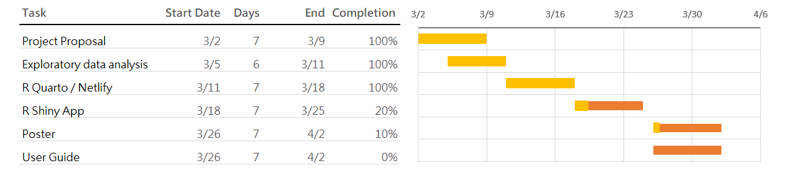

## 1. Project Motivation & Objective

The Colombian fintech sector has seen record growth (reaching nearly 400 companies by 2024), yet understanding the "why" behind user retention and satisfaction remains a challenge.

-   **The Goal:** Move beyond simple reporting to understand how socio-demographics (age, income level, education) drive actual financial behavior.

-   **The Problem:** Fintech users are not a monolith; "Mainstream" users have vastly different needs than "High-Value" investors. Our tool will allow stakeholders to segment these users dynamically.

## 2. Data Overview: The COFINFAD Dataset

The dataset captures this transition from traditional cash-based behavior to a digital-first economy.

-   **Transactional Data**: Captures the "pulse" of activity across 3.1M+ records, categorized into `Transfer`, `Withdrawal`, and `Payment`.

-   **Customer Profiles**: Includes 54 variables that allow us to see how demographics (like the **income_bracket** or **location**) correlate with **app_logins_frequency** and **satisfaction_score**.

|  |  |  |  |
|------------------|------------------|------------------|------------------|
| **Category** | **Key Variables** | **Data Type** | **Purpose** |
| **Demographics** | Age, Income, Education, Household Size | Categorical/Numeric | Basis for segmentation and bias checks. |
| **Engagement** | Digital Engagement Score, App Open Frequency | Numeric (0-1) | Identifying "Sticky" vs. "Chilled" users. |
| **Financials** | Total Transaction Vol, Avg Trans Value, Frequency | Continuous | Measuring the "wallet share" of the user. |
| **Sentiment** | Customer Satisfaction (CSAT) Score | Ordinal (1-5) | Target variable for predictive modeling. |

## 3. The Methodology (The "Three Pillars")

This is where you align your team's specific roles with the technical approach:

### A. Exploratory & Confirmatory Analysis (EDA/CDA)

-   **Focus:** Use **Non-parametric tests** (like Kruskal-Wallis) to see if transaction volume significantly differs across income brackets.

-   **Visuals:** Boxplots for distribution and **Correlation Matrices** to see if "Age" actually correlates with "Transaction Frequency."

### B. Customer Segmentation (Clustering)

-   **Approach:** Perform **K-Means** or **Hierarchical Clustering** using R's `cluster` and `factoextra` packages.

-   **Objective:** Identify the "Profiles." Are high-income users actually the most active, or is it the mid-income "digital natives"?

### C. Predictive Modelling

-   **Target:** Predict **Customer Satisfaction** (High vs. Low) or **Churn Risk**.

-   **Algorithm:** Use **Random Forest** or **Logistic Regression**. We will visualize "Variable Importance" to show which factors (e.g., App speed vs. Transaction fees) drive satisfaction most.

## 4. Prototype

The team has decided to split the main prototype modules as follows:

-   Exploratory Data Analysis

-   Clustering Analysis

-   Predictive Analysis

## 5. Project Timeline and Work Allocation

